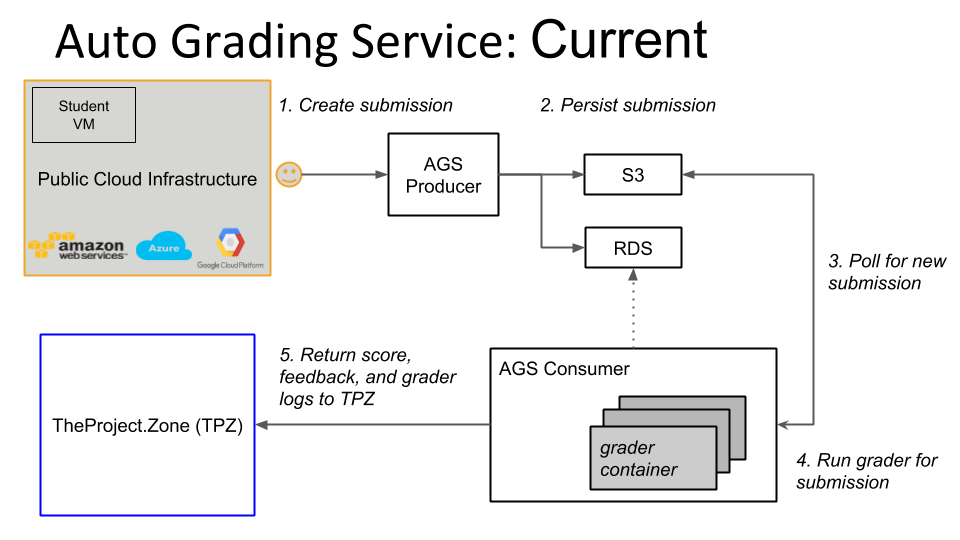

### Submitter HOWTO



Git clone & use base code from [Cameron's example repo](https://github.com/11-791SoftwareEngineeringForIT/Project0), which has hard coded [several variables](https://github.com/11-791SoftwareEngineeringForIT/Project0/blob/master/submitter/submitter.sh#L23-L29) for us:
```
    # Module / task specific fields
    # Task Id and TPZ key from https://theproject.zone/f18-11791/pi0/tasks/hello-world
    semester="f18"
    courseId="11791"
    projectId="pi0"
    taskId="hello-world"
tpz_key="KMZL8VGavxwtkXp1DrsjLEKXfoOBuhGJ"
```

Supply some variables on command line:
```
export TPZ_USERNAME=er1k@andrew.cmu.edu
```
Note: if you forget to do this and run the `submitter.sh` it will instruct you to set to "your gmail address" - this is misleading. It should be your TPZ userid which is typically an Andrew email, not GMail.

Get the submission code from the F18-11791 prototype [TPZ page](https://theproject.zone/f18-11791/pi0) (click "Get Submission Password" button, copy paste)
```
export TPZ_PASSWORD=H6CmXQOGRc34zRYyKzIa9y
```
Run the submitter script
```
er1k@islpc22:~/ACAI/Project0/submitter$ ./submitter.sh
####################
# INTEGRITY PLEDGE #
####################
Have you cited all the reference sources (both people and websites) in the file named 'references'? (Type "I AGREE" to continue). By typing "I AGREE", you agree that you have not cheated in any way when completing this project. Cheating can lead to severe consequences.
I AGREE
TODO!
Uploading answers, files larger than 5M will be ignored...
{"status":1209,"success":true,"message":"Your submission is in processing, submission token is:er1k@andrew.cmu.edu_pi0_hello-world_121\
1059739 Wait and check your code, score and feedback on TPZ."}If your submission is uploaded successfully. Log in to theproject.zone and open the submissions table to see how you did!
```
Check the TPZ submissions table page, https://theproject.zone/f18-11791/pi0/submissions - is it there? no :(

Why not? There was no data. :)  The submitter only does the following:

  * Runs a 'grade' function locally - essentially just runs the homework code
  * Creates a tarball of (output) files from the working directory
  * Uploads the tarball to TPZ AGS
  * Along with this, lots of metadata, much we don't know about:
    - andrewId
    - password
    - dns
    - semester
    - courseId
    - projectId
    - taskId
    - lan
    - tpzKey
    - feedbackId
    - codeId
    - useContainer
    - taskLimit
    - update
    - pending
    - duration
    - checkResult
    
According to [TPZ/AGS docs](https://github.com/CloudComputingCourse/TA-Manual/wiki/grader-HOWTO#enable-ags-support-for-a-task), each new Task (homework) we create requires emailing Cameron/Marshall to manually enable it by ID

Edit `submitter.sh` to update (hard-coded) `projectId` and `taskId` variables, for example
```
er1k@islpc22:~/ACAI/Project0/submitter$ diff submitter.sh submitter4.sh
27c27
<     projectId="pi0"                             # created at "Create New Project" time in TPZ
---
>     projectId="fixing-module-titles"                             # created at "Create New Project" time in TPZ
29c29
<     taskId="hello-world"                        # the same as "Slug" in the Edit Task pop-up
---
>     taskId="P4M1T1"                        # the same as "Slug" in the Edit Task pop-up
```
Presumably we DO NOT need to do what the [TPZ submitter HOWTO](https://github.com/CloudComputingCourse/TA-Manual/wiki/submitter-HOWTO#compile-the-submitter-with-docker-and-makefile) does, which is to compile the `submitter.sh` bash script into an executable, and store the compiled `submitter` executable as part of the GitHub repository given to students, and associated with the homework

## Grader HOWTO
This is more complicated. We're waiting on Cameron's [skeleton grader implementation](https://github.com/11-791SoftwareEngineeringForIT/Project0#grader) which will be hopefully much simpler than the full [TPZ/AGS implementation](https://github.com/CloudComputingCourse/TA-Manual/wiki/grader-HOWTO) that uses a grader Amazon Machine Image, Docker, Makefile, ans possibly Maven + Java as well. Now that I've been added to GitHub repositories, can see the missing:

 * [grader-utils library](https://github.com/CloudComputingCourse/grader-utils)
 * [upload grader Maven plugin](https://github.com/CloudComputingCourse/CloudComputingUtils/tree/master/upload-grader-maven-plugin)
 
 Still have only the vaguest notion of what to do with these, still would really love to see a TUTORIAL with EXAMPLES that WORK.
 Do I really need to use Maven? Do I really need to use Java? I don't have an environment for these, have been Java free for 5 years and loving it.
 
 ## SUCCESS!
 Yes, Martha, we do need Java. AND Maven. And the big reveal is that there are more components to be run in a specific order. But first, to explain what was misunderstood about the compiled obfuscated shell script: This is something given to students. So they can't reverse engineer it.
 
 Now the components, and the order:
 
 1. Develop a Grader (component) in `grader/`  
 1a. Run `mvn package` in `grader/` to create `target/java_grader.jar`  
 2. Run an Uploader (component) to upload the Grader to TPZ. Currently there's little feedback or means to verify the grader is there, visible, on TPZ, but we're told this is coming.  
 ```
 mvn upload-grader:upload -Dupload.andrewId=<ANDREW_ID> -Dupload.password=<TPZ_PWD> -Dupload.filename=target/java_grader.jar
 ```
 3. Run a Submitter (component). This submits a homework (TPZ "Task" / part of a TPZ "Project") to TPZ, which then gets executed on TPZ cloud infrastructure and interacts with the Grader
 4. View results in a web browser, in the TPZ Submissions tab for a Project. I believe there can be multiple tabs per project, one per "Task" (homework), a URL for example https://theproject.zone/f18-11791/pi0/submissions that you navigate to by
    a. Log into TPZ
    b. authenticate with andrew credentials
    c. Navigate to Course
    d. Navigate to Project
    e. Navigate to Submissions

### reference.yaml vs output.json
Between grader and submitter, `reference.yaml` contains the expected result, but `output.json` contains the actual result sent to the grading service. These are not only different formats, but somewhat obscure in location (assuming your directory structure begins with `Projectname` or in our concrete example, `Project0`:  
```
Projectname/submitter/output.json
```
and
```
Projectname/grader/src/main/resources/reference.yaml
```

## More little confusions
TPZ Password is referred to in 3 different ways:
 * Environment variable `TPZ_PASSWORD`
 * Maven comment (how to upload the grader) `TPZ_PWD`
 * TPZ site `TPZ_SUBMISSION_PASSWORD`
 
TPZ Username is referred to in different ways:
 * Environment varialbe `TPZ_USERNAME`
 * Maven comment (how to upload grader) `ANDREW_ID`
 * TPZ site ???
 * `andrewId` in submitter.sh script
 
If your grader got an error, clicking the Grading Complete link of the Feedback tab gives a strange message; it does not tell us how to set the encoding of the web page, only that we should:

Example link: https://cmucc-foryoureyesonly.s3.amazonaws.com/er1k@andrew.cmu.edu_39b32048-253d-4f79-ac52-d4a7af41f94f.txt
```
☁ If the cloud character on the left does not display correctly, set the encoding of the web page to UTF-8.
We addressed the importance of encoding in this course. 
Browsers, such as Chrome, will guess the charset and you must not rely on them.


Submission Time:	2019-01-31 11:24:33


Error occurred in grading. Please contact TA to check it ASAP.
```
Some Googling to find out how - is still super misleading. You can (eventually) find, for Firefox, an interface element to add an icon for "show text encoding options" then one of the choices is "Unicode" (nowhere does it offer UTF-8 as a selection). Maybe there's an implicit assumption about what browser people using TPZ are required to use?

## A crazy lot of dependencies
in list form  
  * pom.xml customized to the project that must contain
    - Where do you get it?
    - groupId e.g. `<groupId>edu.cmu.scs.cs._11791</groupId>`
    - artifactId probably arbitrary, but based on project name e.g. for "project0" `<artifactId>project0-grader</artifactId>` (where does "project0-grader" come from?)
    - `<courseId>11791</courseId>` must correspond to TPZ course ID
    - `<semester>f18</semester>` must correspond to TPZ course semester
    - `<taskId>hello-world</taskId>` must correspond to TPZ course
  * Java source in a folder `src/main/java/edu/cmu/scs/cs/_11791/`
    - must have a public class `Grader`
    - talks about a 'localMode' that is set depending on how it is run
        (localMode exists somewhere hidden in Config or GradingProcessor?, does not appear anywhere in the source of Grader.java)
  * `upload-grader-maven-plugin-0.0.6-RELEASE.jar` which is 23195194 bytes and contains [16717 files](https://github.com/riebling/acai/blob/master/pluginListing.txt)
